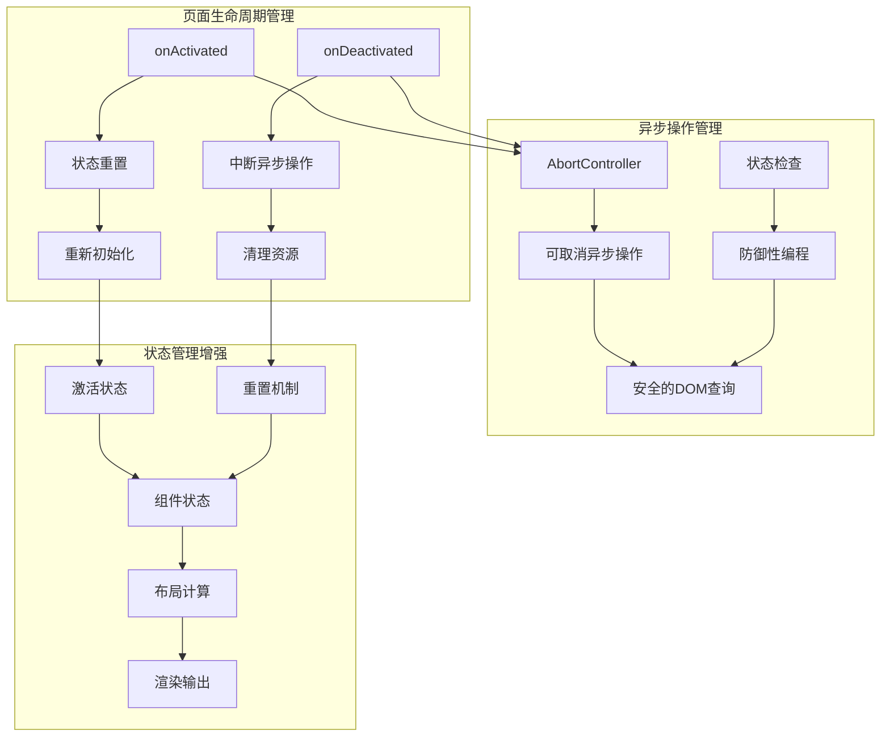

# 瀑布流组件Bug修复设计文档

## 概述

本设计文档针对瀑布流组件在tabbar页面快速切换时出现的布局错乱问题，提供了完整的技术解决方案。该bug的根本原因是异步操作的生命周期管理不当，当用户快速切换页面时，异步操作在错误的时机完成，导致组件状态被污染。

### 问题核心分析

1. **异步操作未被正确中断**：页面切换时，DOM查询、图片加载等异步操作仍在后台执行
2. **状态在页面切换时没有正确重置**：tabbar页面缓存机制导致组件状态持久化，但DOM环境已变化
3. **缺乏页面激活状态感知**：组件无法感知页面的激活/失活状态
4. **DOM查询在错误时机执行**：获取到无效的DOM尺寸信息

## 架构设计

### 整体架构图



### 核心组件修改

#### 1. waterfall.vue 修改设计

**新增状态管理**：

- `isActive`: 页面激活状态
- `abortController`: 异步操作控制器
- 调试日志系统

**生命周期增强**：

- `onActivated`: 页面激活时重置状态并重新初始化
- `onDeactivated`: 页面失活时中断异步操作
- `onBeforeUnmount`: 组件卸载时清理资源

#### 2. waterfall-item.vue 修改设计

**安全性增强**：

- DOM查询前的状态检查
- 异步操作的中断机制
- 错误处理和降级方案

#### 3. waterfall-load.vue 修改设计

**超时机制优化**：

- 页面失活时清理定时器
- 状态检查增强

## 组件和接口设计

### 1. 页面激活状态管理模块

```typescript
interface PageActivationManager {
  isActive: Ref<boolean>
  onActivated: () => void
  onDeactivated: () => void
  resetState: () => void
}
```

**实现要点**：

- 使用Vue的`onActivated`和`onDeactivated`钩子
- 在上下文中提供激活状态给子组件
- 页面激活时重置所有相关状态

### 2. 异步操作管理模块

```typescript
interface AsyncOperationManager {
  abortController: AbortController | null
  createNewOperation: () => AbortController
  abortCurrentOperation: () => void
  safeAsyncOperation: <T>(operation: () => Promise<T>) => Promise<T | null>
}
```

**实现要点**：

- 使用`AbortController`管理异步操作
- 每次新操作前取消之前的操作
- 提供安全的异步操作包装器

### 3. 状态重置管理模块

```typescript
interface StateResetManager {
  resetItemStates: () => void
  resetContainerStates: () => void
  resetLoadStates: () => void
  fullReset: () => void
}
```

**实现要点**：

- 重置所有项目状态（loaded、visible、height、top、left）
- 重置容器状态（containerHeight、containerWidth）
- 重置加载状态（loadStatus、loadedHandlers）

### 4. 防御性编程模块

```typescript
interface DefensiveProgramming {
  validateState: () => boolean
  validateDOMQuery: (element: any) => boolean
  safeGetBoundingClientRect: (selector: string) => Promise<DOMRect | null>
  withStateCheck: <T>(operation: () => T) => T | null
}
```

**实现要点**：

- 多重状态检查
- DOM查询结果验证
- 异常情况的降级处理

### 5. 调试和监控模块

```typescript
interface DebugManager {
  createLogger: (componentName: string) => Logger
  logStateChange: (state: string, value: any) => void
  logAsyncOperation: (
    operation: string,
    status: 'start' | 'end' | 'error',
  ) => void
  logPageLifecycle: (event: string) => void
}

interface Logger {
  log: (message: string, ...args: any[]) => void
  warn: (message: string, ...args: any[]) => void
  error: (message: string, ...args: any[]) => void
}
```

## 数据模型设计

### 增强的瀑布流上下文

```typescript
interface EnhancedWaterfallContext {
  // 原有接口
  addItem: (item: WaterfallItem) => void
  removeItem: (item: WaterfallItem) => void
  onItemLoad: () => void
  columnWidth: ComputedRef<number>

  // 新增接口
  isActive: Ref<boolean>
  containerId: string
  abortController: Ref<AbortController | null>
  debugLogger: Logger
}
```

### 增强的项目状态模型

```typescript
interface EnhancedWaterfallItem {
  // 原有状态
  loaded: boolean
  visible: boolean
  height: number
  top: number
  left: number
  beforeReflow: () => Promise<void>

  // 新增状态
  lastUpdateTime: number
  isValidState: boolean
  errorCount: number
}
```

## 错误处理策略

### 1. DOM查询错误处理

```typescript
const safeGetBoundingClientRect = async (
  selector: string,
): Promise<DOMRect | null> => {
  try {
    // 检查组件状态
    if (!isActive.value || !instance?.isMounted) {
      debug.warn('组件未激活或未挂载，跳过DOM查询')
      return null
    }

    const rect = await getBoundingClientRect(selector, instance)

    // 验证结果有效性
    if (!rect || rect.width <= 0 || rect.height <= 0) {
      debug.warn('DOM查询返回无效结果', rect)
      return null
    }

    return rect
  } catch (error) {
    debug.error('DOM查询失败', error)
    return null
  }
}
```

### 2. 异步操作错误处理

```typescript
const safeAsyncOperation = async <T>(
  operation: () => Promise<T>,
  fallback?: T,
): Promise<T | null> => {
  try {
    // 检查中断信号
    if (abortController.value?.signal.aborted) {
      debug.log('异步操作被中断')
      return null
    }

    const result = await operation()

    // 操作完成后再次检查状态
    if (!isActive.value || abortController.value?.signal.aborted) {
      debug.log('异步操作完成后检测到状态变化，丢弃结果')
      return null
    }

    return result
  } catch (error) {
    if (error.name === 'AbortError') {
      debug.log('异步操作被主动取消')
    } else {
      debug.error('异步操作发生错误', error)
    }
    return fallback || null
  }
}
```

### 3. 状态一致性检查

```typescript
const validateComponentState = (): boolean => {
  const checks = [
    { name: '组件激活状态', valid: isActive.value },
    { name: '组件挂载状态', valid: instance?.isMounted },
    { name: '容器宽度有效性', valid: containerWidth.value > 0 },
    { name: '项目列表完整性', valid: Array.isArray(items) },
  ]

  const failedChecks = checks.filter((check) => !check.valid)

  if (failedChecks.length > 0) {
    debug.warn(
      '状态检查失败',
      failedChecks.map((c) => c.name),
    )
    return false
  }

  return true
}
```

## 测试策略

### 1. 单元测试覆盖

**状态管理测试**：

- 页面激活/失活状态切换
- 状态重置功能
- 异步操作中断机制

**DOM查询测试**：

- 正常情况下的DOM查询
- 组件未激活时的DOM查询
- DOM查询失败的处理

**排版算法测试**：

- 正常排版流程
- 异步操作被中断时的处理
- 状态不一致时的处理

### 2. 集成测试场景

**页面切换测试**：

- 快速切换页面的布局一致性
- 长时间切换后的状态恢复
- 多次切换的内存泄漏检查

**异步操作测试**：

- 图片加载过程中的页面切换
- DOM查询过程中的页面切换
- 排版计算过程中的页面切换

### 3. 性能测试

**渲染性能**：

- 修复前后的渲染时间对比
- 大量项目时的性能表现
- 内存使用情况监控

**异步操作性能**：

- 异步操作的响应时间
- 中断操作的效率
- 状态检查的开销

## 实现细节

### 1. waterfall.vue 关键修改

```typescript
// 新增状态管理
const isActive = ref(true)
const abortController = ref<AbortController | null>(null)
const debug = createDebugger('Waterfall')

// 页面激活处理
onActivated(() => {
  debug.log('页面激活')
  isActive.value = true
  resetState()

  nextTick(async () => {
    await reinitialize()
  })
})

// 页面失活处理
onDeactivated(() => {
  debug.log('页面失活')
  isActive.value = false
  abortCurrentOperations()
})

// 状态重置
const resetState = () => {
  debug.log('重置瀑布流状态')

  // 重置项目状态
  items.forEach((item, index) => {
    item.loaded = false
    item.visible = false
    item.height = 0
    item.top = 0
    item.left = 0
    debug.log(`重置项目 ${index} 状态`)
  })

  // 重置容器状态
  containerHeight.value = 0
  containerWidth.value = 0

  // 重置加载状态
  loadStatus = 'idle'
  loadedHandlers = []
}

// 增强的重排函数
const reflow = throttle(async () => {
  debug.log('开始重排')

  // 创建新的异步操作控制器
  if (abortController.value) {
    abortController.value.abort()
  }
  abortController.value = new AbortController()
  const signal = abortController.value.signal

  try {
    // 状态检查
    if (!validateComponentState()) {
      debug.warn('组件状态无效，跳过重排')
      return
    }

    // 执行排版逻辑...
    const result = await safeAsyncOperation(async () => {
      // 原有的排版逻辑，但加入中断检查
      return performLayout(signal)
    })

    if (result && !signal.aborted) {
      debug.log('重排完成')
    }
  } catch (error) {
    debug.error('重排过程发生错误', error)
  }
}, 50)
```

### 2. waterfall-item.vue 关键修改

```typescript
// 增强的高度更新
const updateHeight = async () => {
  const context = inject(waterfallContextKey)

  try {
    // 多重状态检查
    if (!instance?.isMounted) {
      debug.warn('组件未挂载，跳过高度更新')
      return
    }

    if (context?.isActive === false) {
      debug.warn('父组件未激活，跳过高度更新')
      return
    }

    // 安全的DOM查询
    const rect = await safeGetBoundingClientRect(`.${itemId}`)

    if (rect && rect.height > 0) {
      item.height = rect.height
      debug.log(`项目 ${itemId} 高度更新为: ${rect.height}`)
    } else {
      debug.warn(`项目 ${itemId} 获取到无效尺寸，使用默认高度`)
      item.height = 100 // 默认高度
    }
  } catch (error) {
    debug.error('更新高度失败', error)
    item.height = 100 // 降级方案
  }
}
```

### 3. 调试工具实现

```typescript
const createDebugger = (componentName: string) => {
  const prefix = `[瀑布流-${componentName}]`

  return {
    log: (message: string, ...args: any[]) => {
      console.log(`${prefix} ${message}`, ...args)
    },
    warn: (message: string, ...args: any[]) => {
      console.warn(`${prefix} ${message}`, ...args)
    },
    error: (message: string, ...args: any[]) => {
      console.error(`${prefix} ${message}`, ...args)
    },
  }
}
```

## 兼容性考虑

### 1. Vue版本兼容性

- 确保`onActivated`和`onDeactivated`在Vue 3.4+中正常工作
- `AbortController`的浏览器兼容性检查

### 2. uniapp平台兼容性

- 不同平台的页面生命周期差异
- DOM查询API的平台适配

### 3. 向后兼容性

- 保持原有API接口不变
- 新增功能作为可选特性

### 3. uniapp获取dom节点的api注意

- uniapp获取dom节点信息的api待dom渲染完成再执行，同时api自身也有延迟，这种情况有点极端，页面切换后 uni.createSelectorQuery() 获取不到正确节点信息，全部是0导致的，可能是BUG,也可能是页面都没准备好，uni也获取不到信息，实际测试，还有一种极极极极端情况，就是在一瞬间切走在切回来，应该是100毫秒之内，偶尔图片的高度也不准确，应该是图片刚渲染到一半，uni获取到的高度就是不准确的，这种是极极极极端情况了，我现在也没有解决思路，如是正常使用，不会出现极极极极端情况

## 性能优化

### 1. 减少不必要的状态检查

- 使用缓存避免重复检查
- 合并多个检查条件

### 2. 优化异步操作

- 批量处理DOM查询
- 减少不必要的重排触发

### 3. 内存管理

- 及时清理事件监听器
- 避免内存泄漏

## 部署和监控

### 1. 渐进式部署

- 先在测试环境验证
- 逐步推广到生产环境

### 2. 监控指标

- 页面切换后的布局正确率
- 异步操作的成功率
- 性能指标对比

### 3. 回滚方案

- 保留原有代码作为备份
- 提供快速回滚机制

这个设计方案通过系统性的架构改进，从根本上解决了瀑布流组件的异步状态管理问题，同时保持了良好的性能和兼容性。
