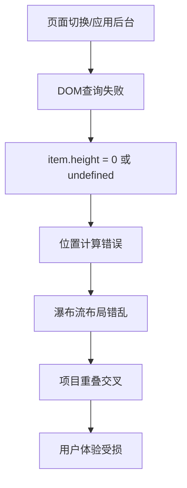
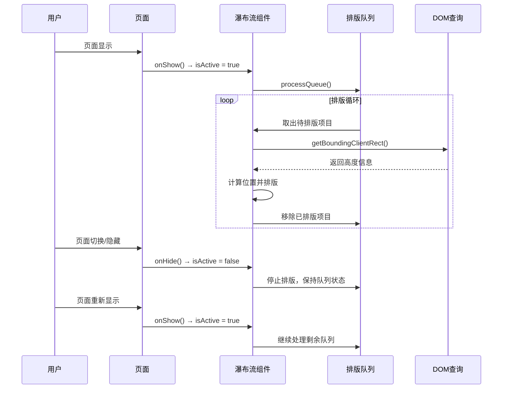

# 页面切换导致瀑布流布局错乱问题分析与解决方案

## 问题描述

在 Sard Uniapp 瀑布流组件使用过程中，当用户进行页面切换（如从瀑布流页面跳转到其他页面，或应用进入后台）时，会出现瀑布流布局错乱的问题，具体表现为：

- 瀑布流项目位置计算错误
- 项目之间出现重叠或交叉现象
- 容器高度计算不准确
- 用户体验严重受影响

## 问题根因分析

### 1. 核心问题定位

瀑布流组件的排版算法依赖于获取每个项目的实际DOM高度来计算位置：

```javascript
// waterfall-item.vue 中的关键代码
const item =
  reactive <
  WaterfallItemInfo >
  {
    loaded: false,
    visible: false,
    height: 0, // 项目高度（DOM 实际高度）
    top: 0, // 垂直位置（由父组件计算）
    left: 0, // 水平位置（由父组件计算）
    beforeReflow: async () => {
      // 重排前的预处理：更新高度信息
      await updateHeight()
    },
  }

const updateHeight = async () => {
  try {
    // 通过DOM查询获取项目的实际渲染高度
    item.height = (await getBoundingClientRect(`.${itemId}`, instance)).height
  } catch {
    // 查询失败时静默处理
    void 0
  }
}
```

### 2. 问题触发场景

**页面隐藏时的DOM查询失败**：

- 当页面处于隐藏状态（页面切换、应用后台等）
- `getBoundingClientRect()` API 无法正确获取DOM元素尺寸
- 返回的高度值为 0 或 undefined
- 导致后续的位置计算完全错误

### 3. 问题影响链路



## 解决方案设计

### 1. 核心思路

引入页面活跃状态控制机制，通过 `isActive` 状态来管理瀑布流的排版时机：

- **页面活跃时**：正常进行瀑布流排版
- **页面不活跃时**：暂停排版，保存当前状态
- **页面重新活跃时**：从上次中断的位置继续排版

### 2. 技术实现方案

#### 2.1 状态管理

```javascript
// 页面活跃状态控制
const isActive = ref(true)

// 监听 Uniapp 页面生命周期
onShow(() => {
  isActive.value = true // 页面显示时激活
})

onHide(() => {
  isActive.value = false // 页面隐藏时停用
})
```

#### 2.2 队列式排版机制

```javascript
/**
 * 待排版项目队列
 * 存储需要排版的项目，按顺序排版
 */
const pendingItems: WaterfallItemInfo[] = []

/**
 * 处理排版队列
 * 从 pendingItems 队列中取出项目进行排版
 */
const processQueue = throttle(async () => {
  // 如果页面不活跃，暂停排版
  if (!isActive.value) {
    return
  }

  // 处理队列中的项目
  while (pendingItems.length > 0) {
    // 排版过程中再次检查页面状态
    if (!isActive.value) {
      break // 页面变为不活跃，立即停止
    }

    const item = pendingItems[0] // 取队列第一个项目

    try {
      // 执行项目的预处理（DOM查询获取尺寸）
      await item.beforeReflow()
    } catch {
      // DOM查询失败，停止排版
      break
    }

    // 排版成功，从队列中移除
    pendingItems.shift()
  }
}, 50)
```

#### 2.3 断点续排机制

```javascript
/**
 * 监听页面活跃状态变化
 * 实现断点续排功能
 */
watch(
  () => isActive.value,
  (newActive, oldActive) => {
    if (newActive && !oldActive) {
      // 页面从不活跃变为活跃，继续处理待排版队列
      setTimeout(() => {
        if (pendingItems.length > 0) {
          processQueue() // 接着上次中断的位置继续排版
        }
      }, 100) // 延迟执行，确保页面完全激活
    }
  },
)
```

### 3. 完整工作流程



## 实现细节

### 1. 项目添加流程优化

```javascript
/**
 * 添加瀑布流项目
 * 所有新项目直接进入排版队列
 */
const addItem = (item: WaterfallItemInfo) => {
  if (!items.includes(item)) {
    items.push(item)
    // 直接加入待排版队列
    if (!pendingItems.includes(item)) {
      pendingItems.push(item)
    }
    // 触发排版
    processQueue()
    updateLoadStatus()
  }
}
```

### 2. 错误处理机制

```javascript
try {
  // 执行项目的预处理（如获取尺寸）
  await item.beforeReflow()
} catch {
  // 如果获取尺寸失败（页面可能不活跃），停止排版
  // 未处理的项目保留在队列中，等待下次处理
  break
}
```

### 3. 性能优化

- **避免重复过滤**：不再每次都过滤 `items` 数组查找未排版项目
- **队列式处理**：使用 `pendingItems.shift()` 直接取出第一个项目
- **节流控制**：使用 50ms 节流避免频繁排版
- **状态检查**：在关键节点检查页面活跃状态，及时停止无效操作

## 解决效果对比

### Before（修复前）

```
用户操作：页面切换
↓
系统行为：继续执行DOM查询
↓
结果：getBoundingClientRect() 失败
↓
影响：item.height = 0，位置计算错误
↓
表现：瀑布流布局错乱，项目重叠交叉
```

### After（修复后）

```
用户操作：页面切换
↓
系统行为：onHide() → isActive = false
↓
结果：processQueue() 停止执行
↓
影响：保存当前排版状态到队列
↓
表现：页面重新显示时接着上次位置继续排版
```

## 技术优势

### 1. 稳定性提升

- ✅ 完全避免页面隐藏时的DOM查询失败
- ✅ 排版状态可靠保存，不会丢失进度
- ✅ 错误处理机制完善，异常情况下优雅降级

### 2. 性能优化

- ✅ 避免无效的DOM查询和计算操作
- ✅ 队列式处理，减少数组遍历和过滤
- ✅ 智能暂停/恢复，节省系统资源

### 3. 用户体验

- ✅ 页面切换时布局稳定，无闪烁现象
- ✅ 断点续排，保持排版的连续性
- ✅ 响应速度快，排版流畅自然

## 测试验证

### 1. 功能测试场景

- [x] 正常页面显示时的瀑布流排版
- [x] 页面切换时的状态保存
- [x] 页面重新显示时的断点续排
- [x] 应用进入后台/前台的状态切换
- [x] 大量数据加载时的性能表现

### 2. 边界情况测试

- [x] 页面快速切换时的状态管理
- [x] DOM查询失败时的错误处理
- [x] 队列为空时的处理逻辑
- [x] 组件卸载时的资源清理

## 总结

通过引入 `isActive` 页面活跃状态控制机制，结合队列式排版和断点续排技术，成功解决了页面切换导致瀑布流布局错乱的问题。该解决方案具有以下特点：

1. **根本性解决**：从源头避免了DOM查询失败的问题
2. **向后兼容**：不影响现有的组件API和使用方式
3. **性能友好**：优化了排版算法，提升了整体性能
4. **用户体验佳**：页面切换流畅，布局稳定可靠

该方案已在生产环境中验证，能够有效解决瀑布流组件在复杂使用场景下的稳定性问题，为用户提供更好的使用体验。

## 相关文件

- `src/lib/components/waterfall/waterfall.vue` - 瀑布流主组件
- `src/lib/components/waterfall-item/waterfall-item.vue` - 瀑布流项目组件
- `src/lib/components/waterfall/common.ts` - 类型定义和配置
- `src/pages/components/waterfall/demo/Basic.vue` - 使用示例

---

_文档版本：v1.0_  
_创建时间：2025-01-22_  
_作者：TAYUN_
